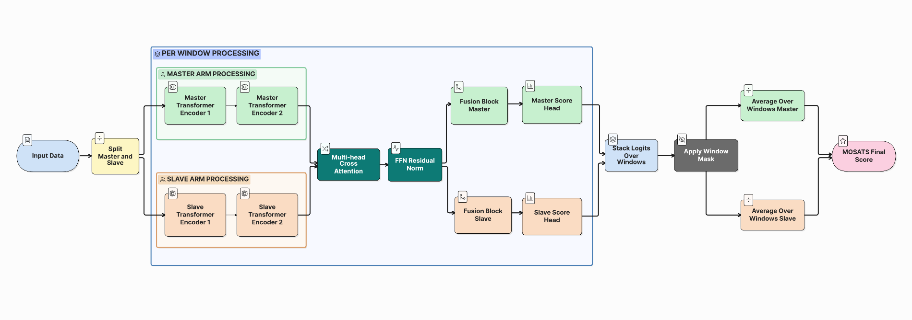

# Beyond Task-Specific Models: A Multi-Task Transformer for Robotic Surgery Skill Assessment

Code for **Beyond Task-Specific Models: A Multi-Task Transformer for Robotic Surgery Skill Assessment**, submitted to *IEEE Transactions on Medical Robotics and Bionics* 

## Introduction

Automatic assessment of surgical skills is a critical component in ensuring valid and high-quality surgical training, with respect to patient safety and clinical care standards. In this paper, we propose a Multi-Task Transformer model that utilizes kinematic data collected from a surgical robot to evaluate surgical skills. We employ the widely used JIGSAWS dataset for training and evaluation of the model, which comprises structured and annotated recordings of surgical tasks from the Da Vinci surgical system. Our proposed model produces an estimate of all six domains of the Modified Objective Structured Assessment of Technical Skills (MOSATS) scale, as well as the overall Global Rating Score (GRS). The experimental results demonstrate a strong correlation between the model's predictions and expert human evaluations, outperforming state-of-the-art models that rely on kinematic data in 83\% of domain-task combinations, achieving a mean Spearman correlation coefficient (SCC) of 0.699 (vs. 0.59). Additionally, the performance of our model in predicting GRS scores (SCC: 0.84) matches or exceeds several vision-based approaches for individual tasks. The model's capacity for generalization across a range of surgical tasks demonstrates its potential as a reliable tool for providing feedback and assistance in surgical training.

## Architecture

  

The MTT master tool manipulators (MTM) and patient-side manipulators (PSM) kinematic data as separate windowed streams and integrates them through cross-attention and a recurrent fusion block (inspired by [Quarez et al., 2024, ReCAP](https://arxiv.org/abs/2407.05180)) to capture both temporal dependencies and interdependencies between subsystems. The prediction heads then output discrete MOSATS scores, obtained by averaging predictions over all windows.

## Getting Started

All experiments, including training and evaluation, were conducted on **Google Colab Pro** using an **NVIDIA A100** GPU and implemented in **PyTorch**

### Data

This project uses the publicly available **JIGSAWS** (JHU-ISI Gesture and Skill Assessment Working Set) dataset. Request access and download it from the [official JIGSAWS page](https://cirl.lcsr.jhu.edu/research/hmm/datasets/jigsaws_release/).

---

**(Updates coming soon!)**